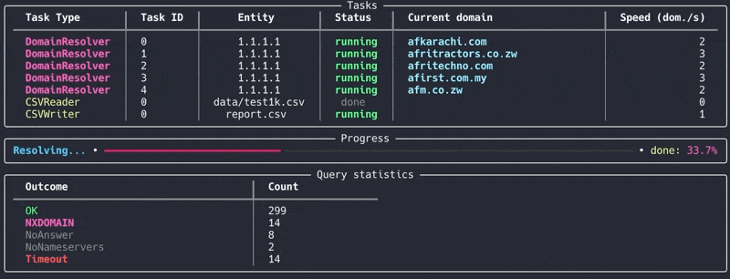

# nxdetective
Mass resolve 100k domains in less than 5 minutes and report non-existent ones.

The purpose of this script is to process a list of domains (e.g., from outbound SMTP logs) and identify non-existent ones. These domains can potentially be registered by adversaries to intercept mistakenly addressed emails.



## Requirements

* Python >= `3.11` (tested with `3.11`)
* Dependencies listed in `Pipfile`

## Installation

1. Clone this repository:
   ```bash
   git clone https://github.com/your-repo/nxdetective.git
   cd nxdetective
   ```

2. Install dependencies using `pipenv`:
   ```bash
   pipenv install
   ```

3. Activate the virtual environment:
   ```bash
   pipenv shell
   ```

## Usage

Run the script with the following command:

```bash
python3 main.py process --nameservers 1.1.1.1,8.8.8.8 --workers_num 5 --qtype A list.csv
```

### Explanation:
- `--nameservers`: Comma-separated list of DNS nameservers to use (e.g., `1.1.1.1,8.8.8.8`).
- `--workers_num`: Number of asynchronous tasks per nameserver (e.g., `5` workers per nameserver).
- `--qtype`: DNS query type to use (e.g., `A`, `MX`, `CNAME`, `TXT`). Default is `A`.
- `list.csv`: Input CSV file containing the list of domains to resolve.

The script will resolve domains from `list.csv` and write non-existent domains to `report.csv`.

### Example `list.csv`:

```csv
domain;popularity
example.org;1
e-xample.org;5
example.cn;3
e-x-ple.com;1
```

_(Note: The `popularity` column is mandatory, but its values are irrelevant and do not affect the script's behavior. It is only used to indicate the subjective popularity of the domain, which can be useful when analyzing logs.)_

### Output:
The results will be saved in `report.csv`, listing all non-existent domains.
